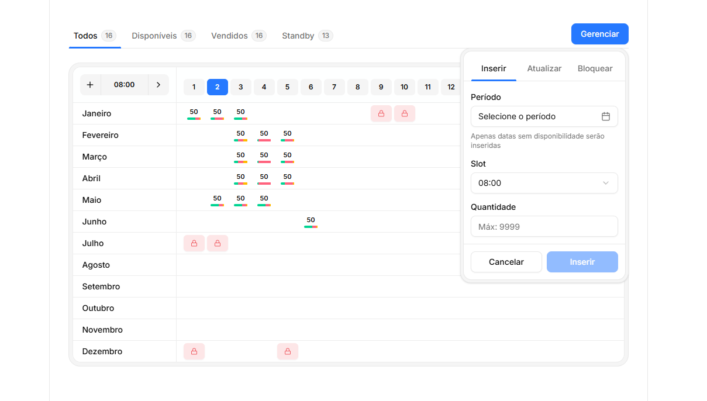

# Tabela de Disponibilidade



## Tecnologias

- [Next.js (Server Actions)](https://nextjs.org)
- [Tailwind CSS](https://tailwindcss.com)
- [Shadcn UI](https://ui.shadcn.com/)


## Instalação

### 1. Clonar o repositório

```bash
git clone https://github.com/thiagop90/my-components.git
```

### 2. Instalar dependências

```bash
npm install
```

### 3. Execute o aplicativo

```bash
npm run dev
```

O aplicativo estará disponível em `http://localhost:3000`.